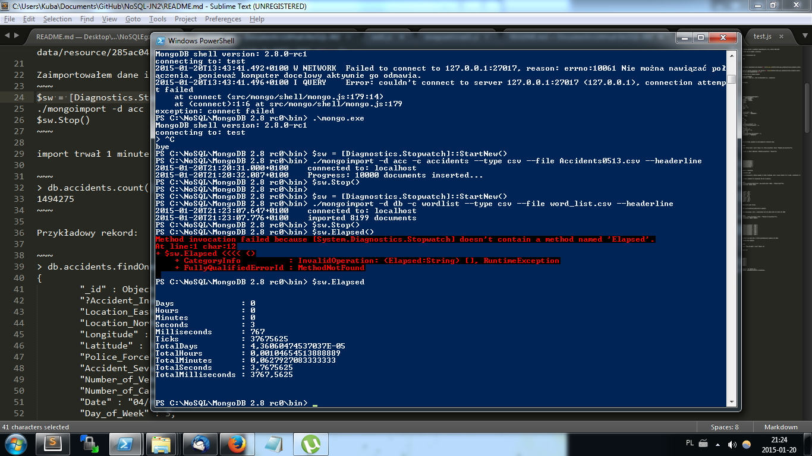
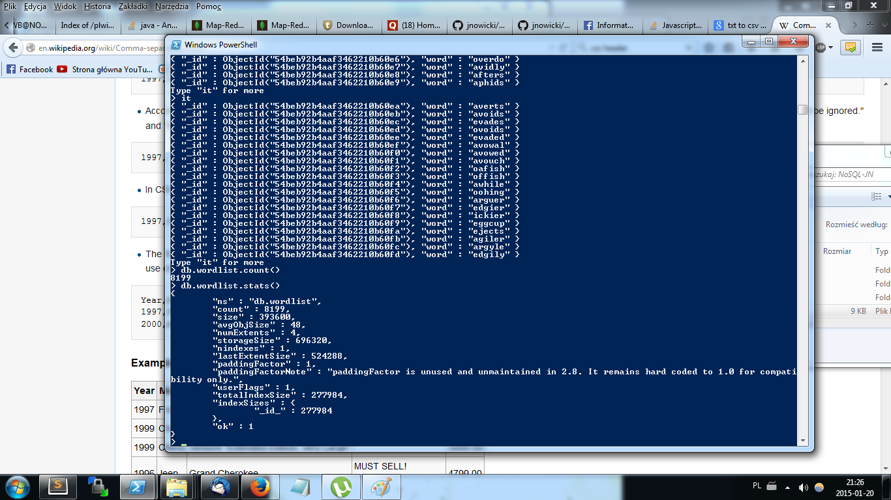
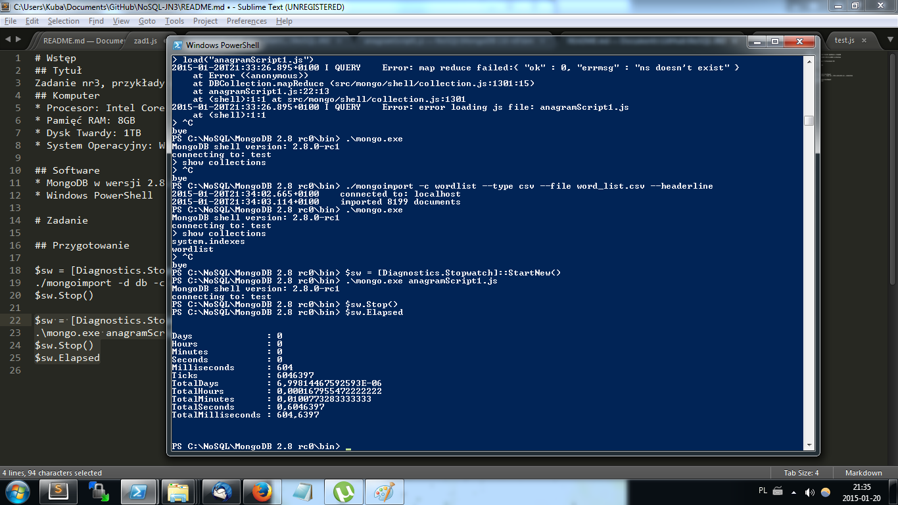
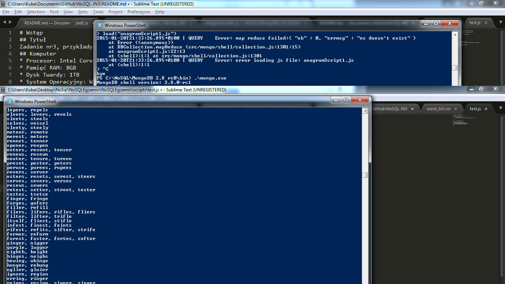
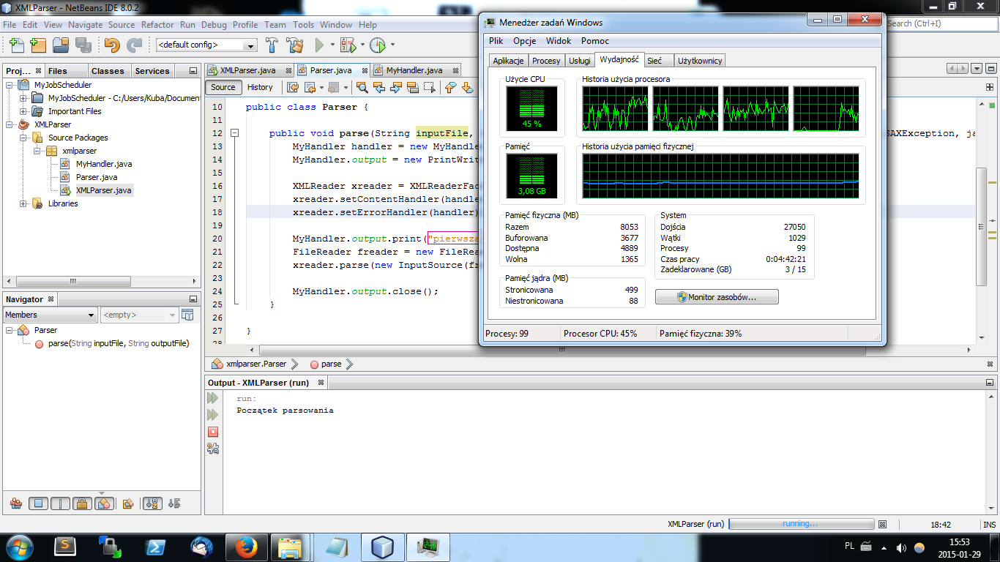
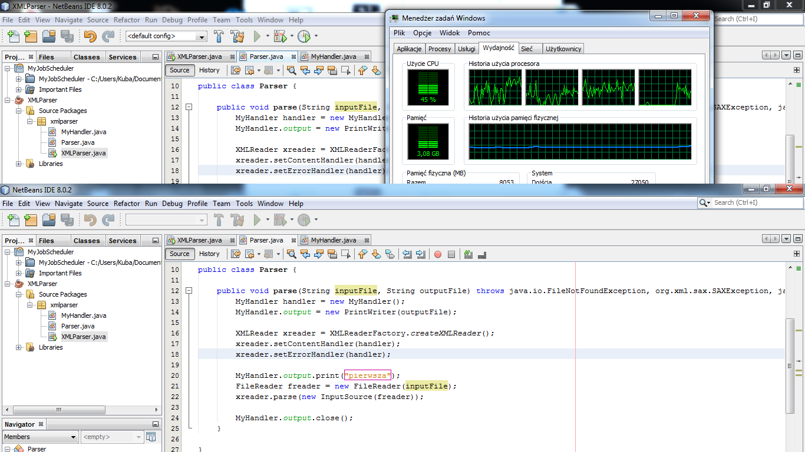
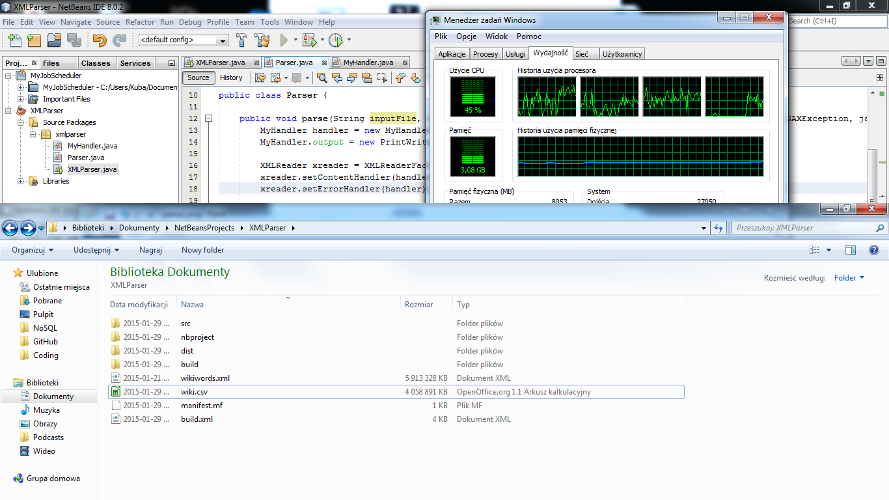
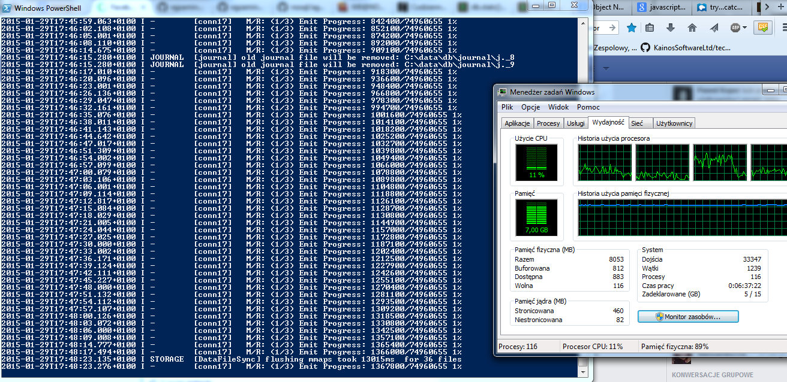

# Wstęp
## Tytuł
Zadanie nr3, przykłady użycia funkcji mapReduce w MongoDB
## Komputer
* Procesor: Intel Core i5-3230M CPU @ 2.60GHz 4-rdzeniowy
* Pamięć RAM: 8GB
* Dysk Twardy: 1TB
* System Operacyjny: Windows 7 Professional SP1

## Oprogramowanie
* MongoDB w wersji 2.8.0 rc0
* Windows PowerShell

# Zadania

## Zadanie 3a

"Przygotować funkcje map i reduce, które wyszukają wszystkie anagramy w pliku word_list.txt"

### Importowanie

Najpierw przerobiłem plik word_list na csv i dodałem header "word", następnie zaimportowałem listę komendą:
~~~
$sw = [Diagnostics.Stopwatch]::StartNew()
./mongoimport -d db -c wordlist --type csv --file word_list.csv --headerline
$sw.Stop()
~~~

  

Dane na temat kolekcji:

  

### Map Reduce

Pisząc algorytm do anagramów zainspirowałem się metodą znalezioną na [Stack Overflow](http://stackoverflow.com/questions/19600442/anagram-algorithm-using-a-hashtable-and-or-tries). Skrypt można znaleźć [tutaj](anagramScript1.js).

~~~
$sw = [Diagnostics.Stopwatch]::StartNew()
.\mongo.exe anagramScript1.js
$sw.Stop()
$sw.Elapsed
~~~

Bardzo krótki czas działania skryptu:

  

Przykładowe anagramy:

  

## Zadanie 3b

"Przygotować funkcje map i reduce, które wyszukają najczęściej występujące słowa z Wikipedia data PL aktualny plik z artykułami, ok. 1.3 GB"

### Sciągnięcie pliku, parsowanie XML

Na początku ściągnąłem najnowsza wersje pliku o nazwie "plwiki-latest-pages-articles-multistream.xml.bz2", około 1,34gb przed rozpakowaniem i około 5.91gb po rozpakowaniu. Zmieniłem nazwe na wikiwords.xml dla uproszczenia.

Do parsowania użyłem [skryptu](XMLParser.java) w javie, używający natywnej biblioteki sax.xml. 

Tutaj początek działania skryptu.
  

I koniec oraz czas zakończenia. Stosunkowo szybkie wykonanie.
  

Rozmiar pliku przed parsowaniem i po parsowaniu(.csv). O wiele mniejszy bez znaczników XML.
  

### Import do bazy

Zaimportowałem i zbadałem czas importu tą komendą
~~~
$sw = [Diagnostics.Stopwatch]::StartNew()
./mongoimport -d wiki -c words --type csv --file wiki.csv --headerline
$sw.Stop()
~~~
Początek importu.
[importwiki1](screenshots/importwiki1.png)  

Zużycie RAM wzrasta. Rdzeń nr 4 procesora pracuje na wątku jak widać.
[importwiki2](screenshots/importwiki2.png)  

Lekkie przepełnienie pamięci w połowie importowania.
[importwiki3](screenshots/importwiki3.png)  

Prawie koniec.
[importwiki4](screenshots/importwiki4.png)  

Koniec. Czas importu 37 minut i 16 sekund.
[importwiki5](screenshots/importwiki5.png)  

Liczba rekordów w bazie oraz dane statystyczne na temat bazy.
[wikicountstats](screenshots/wikicountstats.png)  

Na przykład ciekawe jest to, że dane w storage MMS zajmują aż 17Gb. 

### Map Reduce

Skrypt odpaliłem komendą 

~~~
.\mongo.exe wiki wikiScript1.js
~~~

Początek działania skryptu na serwerze.
  

Skrypt działał bardzo długo, bo nie był zoptymalizowany na wiele wątków i wiele rdzeni procesora.

Kompletny czas działania to było:

~~~
time: 10h 36m 12s
~~~

Najczęsciej powtarzające się słowa:
~~~
> db.wikiCount.find().sort({value:-1}).limit(3)
{ "_id" : "w", "value" : { "count" : 20292468 } }
{ "_id" : "i", "value" : { "count" : 5780516 } }
{ "_id" : "a", "value" : { "count" : 5407771 } }
~~~